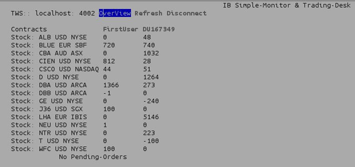
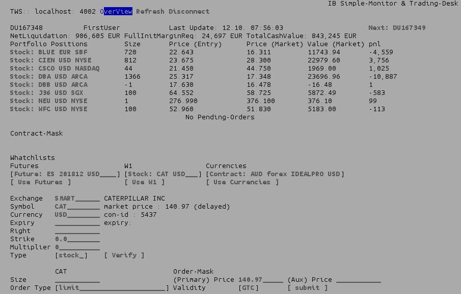
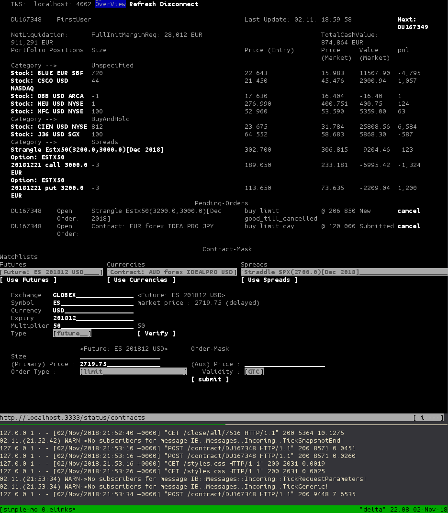

# Simple Monitor
Portfolio-Monitor (not only) for FA-Accounts on InteractiveBrokers

**Base Szenario:** Some trading approach is performed on a remote system. There is at least a reverse-ssh tunnel enabling basic administrative operations. One can establish a remote `tmux`-session, one window is starting the `simple_monitor`, one runs an `elinks`-session displaying the output. 

The monitor is realized using __`IB-Ruby`__ and the camping micro-web-framework. It generates pure HTML and uses CSS, thus providing an overview on every browser, including text-based ones, like `elinks`. Avoids JavaScript.

First an overview of any Portfolio-Position in every Account is displayed (only F&F-Accounts).
You can select all Accounts. Basic information, such as *NetLiquidation*, the used *Margin* and *Available Cash*  are shown.  All Portfolio-Positions  (Contracts) are displayed. 


A *Simple Form* to place an emergency-order (i.e. a "Close-Position"-Feature) is provided, too. New Positions can be established through their basic properties (see below). In practice, one would use the [Watchlist](https://ib-ruby.github.io/ib-doc/watchlists.html) feature to provide additional Contracts. 

#### Getting Started

* **Setup your environment through [IB-Container](https://github.com/ib-ruby/ib-container).**  
  
  or

* Install Ruby 2.6+ (via rvm), tmux and elinks.

* clone this repository ( `git clone https://guthub.com/ib-ruby/simple-monitor.git` )
* change to the simple-monitor directory ( `cd simple-monitor`)

* Initialize with `bundle install` following with `bundle update`   ( get bundler via `gem install bundle` if its not present)

* Start a TWS or a Gateway (TWS must fullfil the requirements of ›› [IB-RUBY]( https://ib-ruby.github.io/ib-doc/) ‹‹).

* Edit `config.yml`  and change the `:host`-Entry to the host running the TWS/Gateway (eg. `localhost:7496`).
  If a connection is made with the Gateway, specify that port, too, eg `localhost:4001`. If no Account-Alias is set in 
  Account-Management, local Aliases can be specified in the yaml-dataset.

* Copy the provided elinks-configuration to the home-directory ( `cp elinks.conf ~/.elinks/` )

* Run the provided tmux-startup-script  ( `./start-simple-monitor` )  **or**

* Run the camping-Server manually
```
camping simple_monitor.rb -p 3333
```
 and open a browser window at http://localhost:3333
enjoy


#### The Output
If an ascii-Browser like `elinks` is used, the following output is generated


If a User is selected or only one User is present, a detail-page is displayed


#### Tmux Startup Script
First edit `./start-simple-monitor` and check if the provided pathes fit your environment.

This is the expected output



